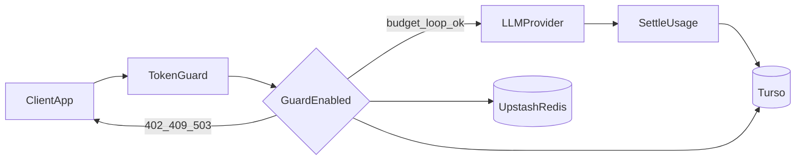

# Architecture

TokenGuard is a single-binary Go HTTP service. The entry point wires config, optional guard dependencies, and an `http.ServeMux`.

## High-level flow



## Process layout

```text
Client App
    │
    ▼
cmd/tokenguard/main.go
    ├── GET  /healthz
    ├── GET  /dashboard          (mgmt enabled)
    ├── POST /mgmt/provision     (mgmt enabled)
    ├── GET  /mgmt/users         (mgmt enabled)
    ├── GET  /mgmt/usage         (mgmt enabled)
    └── /*  → proxy.Handler
            ├── provider selection
            ├── [guard] preflight: budget + loop
            ├── httputil.ReverseProxy → upstream
            └── post-response: token count + settle
```

## Packages

| Package | Role |
|---------|------|
| `cmd/tokenguard` | Process bootstrap, routes, graceful shutdown |
| `internal/proxy` | Reverse proxy, guard preflight, provider routing, mgmt handlers |
| `internal/billing` | Turso store, schema, budgets, API keys, usage events |
| `internal/cache` | Upstash Redis REST client + loop circuit breaker |
| `internal/models` | Pricing table loader and cost estimation |

## Guarded request lifecycle

1. Resolve provider from `X-TokenGuard-Provider`, path heuristics, or default.
2. Require `X-TokenGuard-API-Key` (or `X-TokenGuard-Key`).
3. Read and analyze body: model, estimated input tokens (tiktoken), session id, semantic hash payload.
4. In parallel:
   - **Budget**: look up key → estimate cost from `pricing.json` → reserve micro-USD in Turso.
   - **Loop**: Redis `INCR` on hashed session + semantic payload; trip at threshold.
5. On failure return JSON with `402` (budget), `409` (loop), or `503` (store/breaker unavailable).
6. Strip TokenGuard headers; forward to upstream with provider auth headers intact.
7. After response: count output tokens (including SSE streams), settle actual cost, release unused reservation, log usage event.

## Data stores

| Store | Technology | Owns |
|-------|------------|------|
| Billing ledger | Turso (libSQL) | `users`, `api_keys`, `user_budgets`, `usage_events` |
| Loop state | Upstash Redis REST | Short-TTL counters keyed by session + payload hash |
| Pricing | Local `pricing.json` | Model input/output cost in micro-USD per 1K tokens |

## Dashboard

`internal/ui/dashboard.html` is a static admin UI embedded into the binary and served at `/dashboard` when management is enabled. It calls `/mgmt/users`, `/mgmt/usage`, and `/mgmt/provision` with `X-TokenGuard-Admin-Secret`.

See [API.md](API.md) for routes and headers, and [STRUCTURE.md](STRUCTURE.md) for file ownership.
